{
  "diagram_info": {
    "diagram_name": "High-Level System Architecture & Data Flow",
    "diagram_type": "flowchart",
    "purpose": "To illustrate the high-level architecture of the Warranty and Service Management Platform, detailing the interactions between client interfaces, core microservices, data persistence layers, and external integrations. It highlights critical flows such as Product Registration (OCR), Service Request Management, Real-time Technician Tracking, and Event-Driven Notifications.",
    "target_audience": [
      "System Architects",
      "Backend Developers",
      "DevOps Engineers",
      "Product Owners"
    ],
    "complexity_level": "high",
    "estimated_review_time": "10-15 minutes"
  },
  "syntax_validation": "Mermaid syntax verified and tested for Flowchart TD",
  "rendering_notes": "Optimized for top-down structural viewing with clear subgraph separation for layers (Client, Edge, Service, Data, External).",
  "diagram_elements": {
    "actors_systems": [
      "Consumer Mobile App",
      "Technician Mobile App",
      "Web Portals (SC, Brand, Super Admin)",
      "API Gateway",
      "Identity Service (Auth)",
      "Product Service",
      "Service Request Service",
      "Location Service",
      "Notification Service",
      "Audit Service",
      "Reporting Service",
      "PostgreSQL",
      "Azure Service Bus",
      "Redis",
      "Azure Blob Storage",
      "OpenSearch",
      "Mapbox API",
      "Azure AI Document Intelligence",
      "Firebase Cloud Messaging"
    ],
    "key_processes": [
      "Product Registration & OCR",
      "Service Request Routing & Lifecycle",
      "Real-time Location Streaming",
      "Asynchronous Notifications",
      "Audit Logging",
      "Analytics Reporting"
    ],
    "decision_points": [
      "Auth Validation",
      "Service Area Routing (Geo)",
      "Role-Based Access Control"
    ],
    "success_paths": [
      "User registers product -> Data Stored",
      "Tech updates status -> Notification sent",
      "Tech activates travel mode -> Location streamed to User"
    ],
    "error_scenarios": [
      "OCR Failure (fallback to manual)",
      "Offline Sync (queued via apps)",
      "Service Bus Retry"
    ],
    "edge_cases_covered": [
      "Real-time location latency",
      "High volume reporting queries (Read Replicas)"
    ]
  },
  "accessibility_considerations": {
    "alt_text": "High-level architectural diagram showing the Warranty Platform. Clients (Mobile/Web) connect via API Gateway to microservices (Product, Request, Location, etc.) running on AKS. Data flows to PostgreSQL, Redis, and Blob Storage. External services include Mapbox, Azure AI, and Firebase.",
    "color_independence": "Components are grouped by subgraphs (Layers) and distinct shapes are used for Database vs Services.",
    "screen_reader_friendly": "Flow direction is top-down; labels describe the specific data being transferred (e.g., 'OCR Request', 'Stream Location').",
    "print_compatibility": "High contrast borders and text ensure readability in grayscale."
  },
  "technical_specifications": {
    "mermaid_version": "10.0+ compatible",
    "responsive_behavior": "Scales vertically; subgraphs keep related components grouped.",
    "theme_compatibility": "Compatible with default, forest, and neutral themes.",
    "performance_notes": "Nodes are grouped to minimize edge crossing complexity."
  },
  "usage_guidelines": {
    "when_to_reference": "During architectural reviews, onboarding new engineers, or planning infrastructure scaling.",
    "stakeholder_value": {
      "developers": "Understanding service boundaries and inter-service communication methods (HTTP vs Event Bus vs WebSocket).",
      "designers": "Visualizing the user journey across system components.",
      "product_managers": "Mapping feature requests to specific system components.",
      "QA_engineers": "Identifying integration points for end-to-end testing."
    },
    "maintenance_notes": "Update when new microservices are added or external dependencies change.",
    "integration_recommendations": "Include in the system's root `README.md` or architecture documentation wiki."
  },
  "validation_checklist": [
    "✅ Client layer includes Consumer, Technician, and Web Portals",
    "✅ Core services (Product, Request, Location) are distinct",
    "✅ Data layer includes Postgres, Redis, Blob, and Service Bus",
    "✅ External integrations (OCR, Maps, FCM) are correctly linked",
    "✅ Real-time location flow (WebSockets) is depicted",
    "✅ Event-driven notification flow is depicted",
    "✅ Mermaid syntax passes validation"
  ]
}

---

# Mermaid Diagram

```mermaid
flowchart TD
    %% Styling Definitions
    classDef client fill:#e1f5fe,stroke:#01579b,stroke-width:2px,color:#000
    classDef gateway fill:#fff9c4,stroke:#fbc02d,stroke-width:2px,color:#000
    classDef service fill:#e8f5e9,stroke:#2e7d32,stroke-width:2px,color:#000
    classDef data fill:#f3e5f5,stroke:#7b1fa2,stroke-width:2px,color:#000
    classDef external fill:#ffebee,stroke:#c62828,stroke-width:2px,stroke-dasharray: 5 5,color:#000

    subgraph ClientLayer ["📱 Client Presentation Layer"]
        ConsumerApp("Consumer App<br/>(React Native)"):::client
        TechApp("Technician App<br/>(React Native)"):::client
        WebPortals("Admin Portals<br/>(Next.js)"):::client
    end

    subgraph EdgeLayer ["🛡️ Edge / Ingress"]
        APIGW("Azure API Gateway<br/>(Auth & Routing)"):::gateway
    end

    subgraph ServiceLayer ["⚙️ Core Microservices (AKS)"]
        AuthSvc("Identity Service<br/>(Azure AD B2C)"):::service
        ProductSvc("Product & Warranty<br/>Service"):::service
        RequestSvc("Service Request<br/>Service"):::service
        LocationSvc("Geolocation Service<br/>(WebSockets)"):::service
        NotifSvc("Notification<br/>Service"):::service
        AuditSvc("Audit<br/>Service"):::service
        ReportSvc("Reporting<br/>Service"):::service
    end

    subgraph DataLayer ["🗄️ Data & Event Layer"]
        ServiceBus[("Azure Service Bus<br/>(Pub/Sub Events)")]:::data
        Postgres[("Primary DB<br/>(PostgreSQL + PostGIS)")]:::data
        BlobStore[("Document Storage<br/>(Azure Blob)")]:::data
        Redis[("Real-time Cache<br/>(Azure Redis)")]:::data
        OpenSearch[("Search & Audit Index<br/>(OpenSearch)")]:::data
    end

    subgraph ExternalServices ["🌐 External Integrations"]
        Ext_FCM("Firebase FCM<br/>(Push Notifs)"):::external
        Ext_Maps("Mapbox API<br/>(Routing/Tiles)"):::external
        Ext_OCR("Azure AI<br/>Doc Intelligence"):::external
        Ext_Email("Azure Comm<br/>Services"):::external
    end

    %% -- Connections --

    %% 1. Authentication Flow
    ClientLayer --> APIGW
    APIGW -- "Validate JWT" --> AuthSvc
    AuthSvc -- "User Profile" --> Postgres

    %% 2. Product Registration Flow (OCR)
    ConsumerApp -- "1. Upload Invoice" --> ProductSvc
    ProductSvc -- "2. Store File" --> BlobStore
    ProductSvc -- "3. Analyze Img" --> Ext_OCR
    ProductSvc -- "4. Save Product" --> Postgres
    ProductSvc -- "5. Index Data" --> OpenSearch

    %% 3. Service Request & Routing
    ConsumerApp -- "Create Request" --> RequestSvc
    WebPortals -- "Dispatch/Manage" --> RequestSvc
    RequestSvc -- "Geo-Spatial Query" --> Postgres
    RequestSvc -- "Publish Status Event" --> ServiceBus

    %% 4. Technician Real-time Location Flow
    TechApp -- "1. Activate Travel Mode" --> RequestSvc
    TechApp -- "2. Stream GPS" --> LocationSvc
    LocationSvc -- "3. Cache State" --> Redis
    LocationSvc -- "4. Calc ETA" --> Ext_Maps
    LocationSvc -- "5. Broadcast Pos" --> ConsumerApp

    %% 5. Notifications & Audit
    ServiceBus -- "Consume Events" --> NotifSvc
    ServiceBus -- "Consume Events" --> AuditSvc
    NotifSvc -- "Send Push" --> Ext_FCM
    NotifSvc -- "Send Email" --> Ext_Email
    Ext_FCM -.-> ConsumerApp & TechApp
    AuditSvc -- "Log Critical Action" --> OpenSearch

    %% 6. Analytics
    WebPortals -- "Fetch Reports" --> ReportSvc
    ReportSvc -- "Aggregated Query" --> Postgres
```

