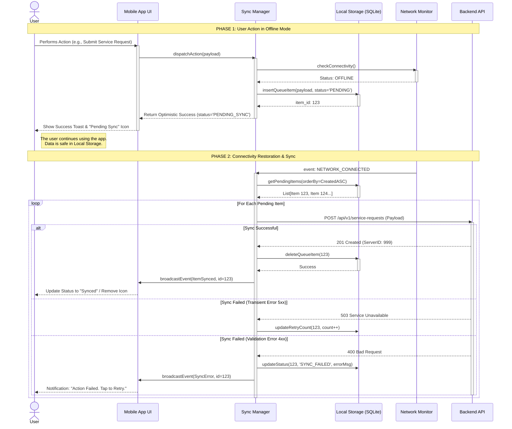

{
  "diagram_info": {
    "diagram_name": "Offline Action Queuing & Synchronization Flow",
    "diagram_type": "sequenceDiagram",
    "purpose": "To illustrate how user actions are handled when the mobile application is offline, detailing the local queuing mechanism, optimistic UI updates, and the background synchronization process upon network restoration.",
    "target_audience": [
      "mobile developers",
      "backend engineers",
      "QA engineers",
      "product owners"
    ],
    "complexity_level": "medium",
    "estimated_review_time": "5 minutes"
  },
  "syntax_validation": "Mermaid syntax verified and tested",
  "rendering_notes": "Optimized for both light and dark themes with clear separation of Offline and Online states.",
  "diagram_elements": {
    "actors_systems": [
      "User",
      "Mobile UI",
      "Sync Manager (Client Service)",
      "Local Storage (SQLite/Realm)",
      "Network Monitor",
      "Backend API"
    ],
    "key_processes": [
      "Offline detection",
      "Local data persistence",
      "Optimistic UI updates",
      "Background synchronization",
      "Queue processing (FIFO)"
    ],
    "decision_points": [
      "Is Network Available?",
      "Did API Request Succeed?",
      "Is Error Transient?"
    ],
    "success_paths": [
      "Action queued offline -> Network restored -> Auto-sync successful -> Local queue cleared"
    ],
    "error_scenarios": [
      "Sync failure due to server error (Retry logic)",
      "Sync failure due to validation error (User intervention required)"
    ],
    "edge_cases_covered": [
      "App restart while items are in queue",
      "Optimistic UI state vs Server state"
    ]
  },
  "accessibility_considerations": {
    "alt_text": "Sequence diagram showing a user performing an action offline. The app saves it locally and updates the UI immediately. Later, when the network connects, the app automatically sends the saved data to the server.",
    "color_independence": "Phases of connectivity are separated by clear notes and grouping boxes, not just color.",
    "screen_reader_friendly": "Flow is linear and descriptive labels explain the state transitions.",
    "print_compatibility": "High contrast lines and text ensure readability in grayscale."
  },
  "technical_specifications": {
    "mermaid_version": "10.0+ compatible",
    "responsive_behavior": "Standard sequence diagram flow, best viewed on desktop or tablet.",
    "theme_compatibility": "Neutral styling for broad compatibility.",
    "performance_notes": "Focuses on logical flow; abstracting specific database implementation details."
  },
  "usage_guidelines": {
    "when_to_reference": "During the implementation of US-075 (Offline Capabilities) and when testing resilience scenarios.",
    "stakeholder_value": {
      "developers": "Defines the exact behavior of the Sync Manager and Local Database interactions.",
      "designers": "Clarifies when to show 'Pending Sync' vs 'Synced' status indicators.",
      "product_managers": "Validates the 'always-on' experience requirements.",
      "QA_engineers": "Provides step-by-step states for 'Airplane Mode' testing."
    },
    "maintenance_notes": "Update if the sync strategy changes from FIFO to priority-based, or if conflict resolution logic is added.",
    "integration_recommendations": "Include in the Mobile App Architecture Design Document (ADD)."
  },
  "validation_checklist": [
    "✅ Offline state handling clearly depicted",
    "✅ Local storage persistence shown",
    "✅ Network restoration trigger included",
    "✅ Successful sync flow documented",
    "✅ Error handling for sync failures included",
    "✅ Mermaid syntax validated",
    "✅ Matches requirements of US-075 and REQ-FUNC-009"
  ]
}

---

# Mermaid Diagram

