{
  "diagram_info": {
    "diagram_name": "Service Request Lifecycle Flowchart",
    "diagram_type": "flowchart",
    "purpose": "To visualize the end-to-end lifecycle of a service request from user submission through technician execution to final closure, highlighting state transitions and actor responsibilities.",
    "target_audience": [
      "Product Managers",
      "Developers",
      "QA Engineers",
      "Service Center Admins"
    ],
    "complexity_level": "medium",
    "estimated_review_time": "5 minutes"
  },
  "diagram_elements": {
    "actors_systems": [
      "Consumer (User)",
      "System (Automation)",
      "Service Center Admin",
      "Technician",
      "Brand Admin"
    ],
    "key_processes": [
      "Request Creation",
      "Automated Routing",
      "Technician Assignment",
      "Field Service Execution",
      "Resolution & Closure"
    ],
    "decision_points": [
      "Warranty Check",
      "Job Completion Check",
      "User Dispute vs Rating",
      "Brand Dispute Decision"
    ],
    "success_paths": [
      "Standard flow: Request -> Assign -> Resolve -> Close"
    ],
    "error_scenarios": [
      "Disputed tickets",
      "Out of warranty flags"
    ],
    "edge_cases_covered": [
      "7-day timeout for auto-closure"
    ]
  },
  "accessibility_considerations": {
    "alt_text": "Flowchart showing the service request process starting from user submission, passing to service center assignment, technician execution, and ending with user feedback or dispute resolution.",
    "color_independence": "Nodes are grouped by subgraphs and labeled clearly to distinguish actors.",
    "screen_reader_friendly": "Flow is directional and logical.",
    "print_compatibility": "High contrast nodes suitable for printing."
  },
  "technical_specifications": {
    "mermaid_version": "10.0+",
    "responsive_behavior": "Vertical layout optimized for scrolling.",
    "theme_compatibility": "Neutral colors defined for broad compatibility.",
    "performance_notes": "Standard node count, fast rendering."
  },
  "usage_guidelines": {
    "when_to_reference": "During development of the Service Request Microservice and when defining QA test cases for job status transitions.",
    "stakeholder_value": {
      "developers": "Defines the exact state machine transitions required in the backend.",
      "designers": "Maps out the necessary UI states for the mobile and web apps.",
      "product_managers": "Validates the business logic of the service loop.",
      "QA_engineers": "Provides a map for end-to-end integration testing."
    },
    "maintenance_notes": "Update if new intermediate statuses (e.g., 'Parts Pending') are added to the workflow.",
    "integration_recommendations": "Embed in the Service Request Module technical design document."
  },
  "validation_checklist": [
    "✅ User submission initiates the flow",
    "✅ Automated routing logic included",
    "✅ Service Center assignment loop visualized",
    "✅ Technician field execution steps detailed",
    "✅ Post-resolution dispute and feedback logic included",
    "✅ Final closure state defined"
  ]
}

---

# Mermaid Diagram

```mermaid
flowchart TD
    %% Define Styles
    classDef user fill:#e3f2fd,stroke:#1565c0,stroke-width:2px,color:#000
    classDef system fill:#f5f5f5,stroke:#616161,stroke-width:2px,color:#000
    classDef scAdmin fill:#fff3e0,stroke:#e65100,stroke-width:2px,color:#000
    classDef tech fill:#e8f5e9,stroke:#2e7d32,stroke-width:2px,color:#000
    classDef decision fill:#fff9c4,stroke:#fbc02d,stroke-width:2px,color:#000
    classDef terminator fill:#ffebee,stroke:#c62828,stroke-width:2px,color:#000

    Start((Start)) --> UserSubmit[User Submits Service Request]
    UserSubmit --> SysValidate{System: Warranty Check}
    
    SysValidate -- Active --> SysFlagIn[Flag: In Warranty]
    SysValidate -- Expired --> SysFlagOut[Flag: Out of Warranty]
    
    SysFlagIn --> SysRoute[System: Route to Service Center]
    SysFlagOut --> SysRoute
    
    SysRoute --> SCQueue[SC Admin: Pending Queue]
    
    subgraph ServiceCenterScope [Service Center Operations]
        SCQueue --> SCAck[SC Admin: Acknowledge Request]
        SCAck --> SCStatus1(Status: Acknowledged)
        SCStatus1 --> SCSelect[SC Admin: Select Technician]
        SCSelect --> SCAssign[SC Admin: Assign Job]
        SCAssign --> TechNotify[System: Notify Technician]
    end
    
    TechNotify --> TechApp[Technician App: My Jobs]
    
    subgraph FieldServiceScope [Field Service Execution]
        TechApp --> TechTravel[Tech: Activate Travel Mode]
        TechTravel --> SysTrack[System: Broadcast Live Location]
        SysTrack --> TechArrive[Tech: Arrive & Start Work]
        TechArrive --> StatusWIP(Status: Work In Progress)
        StatusWIP --> TechDiagnose[Tech: Perform Repair]
        TechDiagnose --> TechComplete{Job Complete?}
        
        TechComplete -- No --> StatusWIP
        TechComplete -- Yes --> TechNotes[Tech: Enter Notes & Parts]
        TechNotes --> TechSig[Tech: Capture Customer Signature]
        TechSig --> TechResolve[Tech: Mark as Resolved]
    end
    
    TechResolve --> StatusResolved(Status: Resolved)
    StatusResolved --> UserNotify[System: Notify User & Request Rating]
    
    subgraph PostServiceScope [Post-Service & Closure]
        UserNotify --> UserAction{User Action within 7 Days}
        
        UserAction -- "Submit Rating" --> SysLogRating[System: Save Rating]
        SysLogRating --> AutoClose
        
        UserAction -- "Dispute Resolution" --> StatusDispute(Status: Disputed)
        StatusDispute --> BrandReview[Brand Admin: Review Dispute]
        BrandReview --> BrandDecide{Decision?}
        BrandDecide -- "Re-Open" --> SCQueue
        BrandDecide -- "Uphold/Close" --> AutoClose
        
        UserAction -- "No Action (Timeout)" --> AutoClose[System: Auto-Close Ticket]
    end
    
    AutoClose --> End((End: Ticket Closed))

    %% Apply Styles
    class Start,UserSubmit,UserAction,UserNotify,Feedback user
    class SysValidate,SysRoute,SysTrack,TechNotify,SysLogRating,AutoClose system
    class SCQueue,SCAck,SCSelect,SCAssign,SCStatus1,BrandReview,BrandDecide scAdmin
    class TechApp,TechTravel,TechArrive,StatusWIP,TechDiagnose,TechNotes,TechSig,TechResolve,StatusResolved,StatusDispute tech
    class TechComplete,SysValidate,UserAction,BrandDecide decision
    class End,SysFlagIn,SysFlagOut terminator
```

