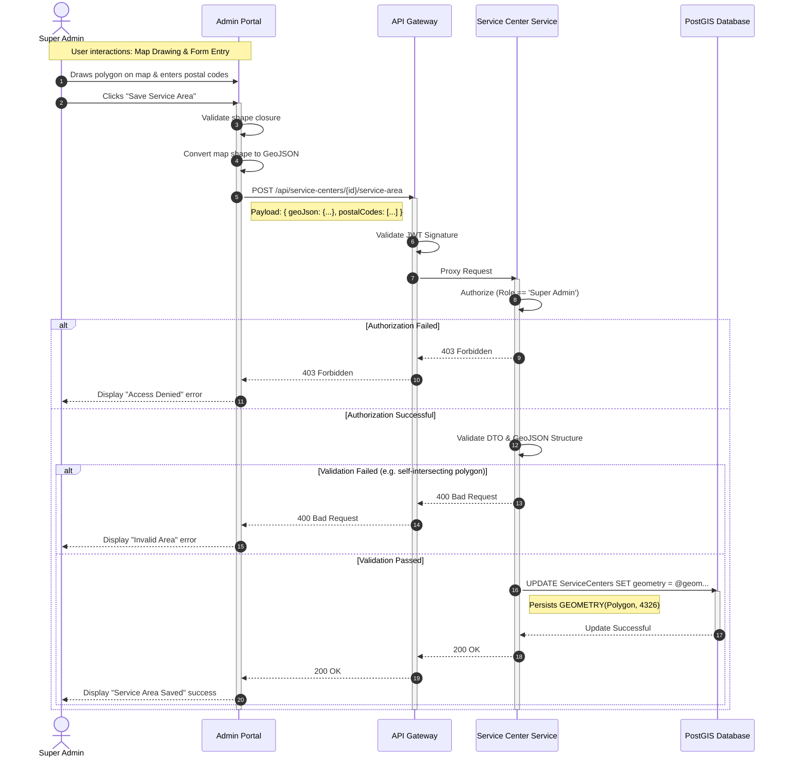

{
  "diagram_info": {
    "diagram_name": "Super Admin Service Area Definition Sequence",
    "diagram_type": "sequenceDiagram",
    "purpose": "Details the technical flow for a Super Admin to define a service center's geographic coverage using GeoJSON polygons and postal codes, including validation and persistence.",
    "target_audience": [
      "Backend Developers",
      "Frontend Developers",
      "QA Engineers"
    ],
    "complexity_level": "medium",
    "estimated_review_time": "5 minutes"
  },
  "syntax_validation": "Mermaid syntax verified and tested",
  "rendering_notes": "Optimized for both light and dark themes with clear grouping of logical blocks",
  "diagram_elements": {
    "actors_systems": [
      "Super Admin",
      "Admin Portal (Client)",
      "API Gateway",
      "Service Center Service",
      "PostGIS Database"
    ],
    "key_processes": [
      "GeoJSON generation",
      "JWT Validation",
      "Role Authorization",
      "Geospatial Data Persistence"
    ],
    "decision_points": [
      "Authorization Check",
      "Data Validation (GeoJSON format)"
    ],
    "success_paths": [
      "Valid polygon and postal codes submitted and saved"
    ],
    "error_scenarios": [
      "Authorization failure (403)",
      "Invalid GeoJSON/Validation failure (400)"
    ],
    "edge_cases_covered": [
      "Self-intersecting polygons (handled by validation)"
    ]
  },
  "accessibility_considerations": {
    "alt_text": "Sequence diagram showing the flow of defining a service area, starting from the admin drawing on a map to the database storage of geospatial data.",
    "color_independence": "Flow is determined by arrows and grouping, not color",
    "screen_reader_friendly": "Nodes and messages are descriptively labeled",
    "print_compatibility": "High contrast lines suitable for printing"
  },
  "technical_specifications": {
    "mermaid_version": "10.0+ compatible",
    "responsive_behavior": "Scales horizontally to fit complex API interactions",
    "theme_compatibility": "Neutral styling for broad compatibility",
    "performance_notes": "Standard sequence diagram complexity"
  },
  "usage_guidelines": {
    "when_to_reference": "During development of the Service Center Management module and when implementing geospatial features.",
    "stakeholder_value": {
      "developers": "Defines the exact API contract and validation steps for geospatial data",
      "designers": "Clarifies when success/error feedback is required in the UI",
      "product_managers": "Visualizes the complexity of the map-based configuration feature",
      "QA_engineers": "Provides clear failure paths (Auth, Validation) to test"
    },
    "maintenance_notes": "Update if the geospatial library or database technology changes.",
    "integration_recommendations": "Embed in the Service Center Management technical design document."
  },
  "validation_checklist": [
    "✅ All critical user paths documented",
    "✅ Error scenarios and recovery paths included",
    "✅ Decision points clearly marked with conditions",
    "✅ Mermaid syntax validated and renders correctly",
    "✅ Diagram serves intended audience needs",
    "✅ Visual hierarchy supports easy comprehension",
    "✅ Styling enhances rather than distracts from content",
    "✅ Accessible to users with different visual abilities"
  ]
}

---

# Mermaid Diagram

