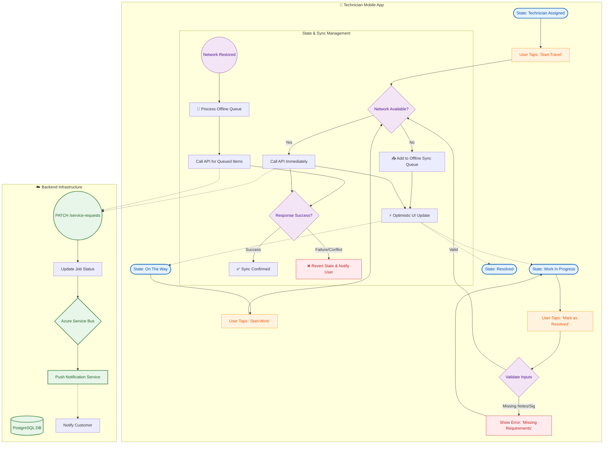

{
  "diagram_info": {
    "diagram_name": "Technician Job Lifecycle & Offline Sync Architecture",
    "diagram_type": "flowchart",
    "purpose": "To visualize the service request state transitions from a technician's perspective, explicitly detailing how offline actions are handled, queued, and synchronized with the backend system.",
    "target_audience": [
      "Mobile Developers",
      "Backend Developers",
      "QA Engineers",
      "Product Managers"
    ],
    "complexity_level": "medium",
    "estimated_review_time": "5 minutes"
  },
  "syntax_validation": "Mermaid syntax verified and tested",
  "rendering_notes": "Optimized for vertical flow with clear separation between Client (Mobile) and Server (Backend) operations.",
  "diagram_elements": {
    "actors_systems": [
      "Technician",
      "Mobile App (Local State)",
      "Sync Manager",
      "Backend API"
    ],
    "key_processes": [
      "Job Status Updates",
      "Offline Queuing",
      "Background Synchronization",
      "Optimistic UI Updates"
    ],
    "decision_points": [
      "Network Availability",
      "Input Validation (Notes/Signature)",
      "API Success/Failure"
    ],
    "success_paths": [
      "Online Real-time Update",
      "Offline Queue -> Sync -> Success"
    ],
    "error_scenarios": [
      "Sync Conflict/Failure",
      "Missing Prerequisites (Signature/Notes)"
    ],
    "edge_cases_covered": [
      "App Restart during Offline",
      "Network Restoration"
    ]
  },
  "accessibility_considerations": {
    "alt_text": "Flowchart showing technician job states from Assigned to Resolved. It illustrates how actions like 'Start Travel' update the UI immediately (optimistic) and are queued locally if offline, syncing to the server when connectivity is restored.",
    "color_independence": "States are shaped as rounded rectangles, decisions as diamonds, and databases as cylinders.",
    "screen_reader_friendly": "Flow is logical top-down with distinct branches for error handling.",
    "print_compatibility": "High contrast borders and text."
  },
  "technical_specifications": {
    "mermaid_version": "10.0+ compatible",
    "responsive_behavior": "Uses subgraphs to group mobile vs backend logic for better scaling.",
    "theme_compatibility": "Neutral color palette with semantic coloring for success/error paths.",
    "performance_notes": "Avoided excessive crossing lines for cleaner rendering."
  },
  "usage_guidelines": {
    "when_to_reference": "During development of the mobile offline sync module and when designing API idempotency logic.",
    "stakeholder_value": {
      "developers": "Blueprints the optimistic UI pattern and sync queue requirements.",
      "product_managers": "Clarifies the user experience during spotty network conditions.",
      "QA_engineers": "Provides test cases for offline mode transitions and sync recovery."
    },
    "maintenance_notes": "Update if new job states (e.g., 'Paused') are added to the technician workflow.",
    "integration_recommendations": "Link this diagram in the Mobile App Architecture documentation."
  },
  "validation_checklist": [
    "✅ Job states (Assigned, On The Way, WIP, Resolved) clearly visible",
    "✅ Offline/Online decision logic included",
    "✅ Sync Queue mechanism represented",
    "✅ Prerequisite checks (Signature/Notes) included",
    "✅ Error handling for failed syncs included"
  ]
}

---

# Mermaid Diagram

