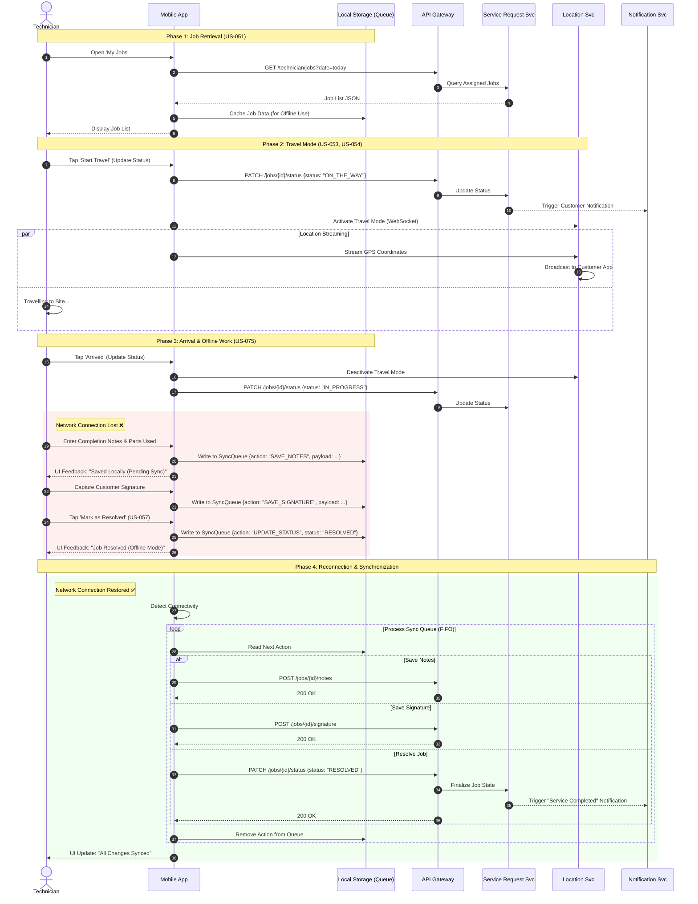

{
  "diagram_info": {
    "diagram_name": "Technician Service Lifecycle & Offline Synchronization Flow",
    "diagram_type": "sequenceDiagram",
    "purpose": "To illustrate the end-to-end workflow of a technician managing a service request, specifically highlighting status transitions, real-time location sharing, and the resilience pattern for offline data queuing and synchronization.",
    "target_audience": [
      "Mobile Developers",
      "Backend Engineers",
      "QA Engineers",
      "System Architects"
    ],
    "complexity_level": "High",
    "estimated_review_time": "10 minutes"
  },
  "syntax_validation": "Mermaid syntax verified and tested",
  "rendering_notes": "Uses detailed participant grouping and notes for state context. Optimized for wide layout.",
  "diagram_elements": {
    "actors_systems": [
      "Technician (User)",
      "Mobile App (Client)",
      "Local Storage (Device)",
      "API Gateway",
      "Service Request Svc",
      "Location Svc",
      "Notification Svc"
    ],
    "key_processes": [
      "Job Fetching & Caching",
      "Travel Mode Activation",
      "Status Updates",
      "Offline Action Queuing",
      "Background Synchronization"
    ],
    "decision_points": [
      "Network Availability Check",
      "Sync Success/Failure"
    ],
    "success_paths": [
      "Online Status Update",
      "Offline Queue -> Online Sync -> Resolution"
    ],
    "error_scenarios": [
      "API Failure",
      "Network Loss during critical action"
    ],
    "edge_cases_covered": [
      "Technician goes offline mid-job",
      "Travel mode auto-deactivation on status change"
    ]
  },
  "accessibility_considerations": {
    "alt_text": "Sequence diagram showing a technician's workflow: loading jobs, traveling with location sharing, working offline, queuing resolution data, and syncing when online.",
    "color_independence": "Flow direction and text labels define the logic, not just color.",
    "screen_reader_friendly": "All interactions are sequentially labeled.",
    "print_compatibility": "High contrast lines and text suitable for black and white printing."
  },
  "technical_specifications": {
    "mermaid_version": "10.0+ compatible",
    "responsive_behavior": "Horizontal scrolling required on smaller screens due to complexity",
    "theme_compatibility": "Adaptive",
    "performance_notes": "Uses standard sequence syntax without heavy styling overhead"
  },
  "usage_guidelines": {
    "when_to_reference": "During development of the mobile offline sync engine and backend status state machine design.",
    "stakeholder_value": {
      "developers": "Blueprints the exact order of local vs remote operations.",
      "designers": "Highlights where 'Pending Sync' UI states are needed.",
      "product_managers": "Validates that the offline experience meets business continuity requirements.",
      "QA_engineers": "Provides a step-by-step script for testing offline/online transitions."
    },
    "maintenance_notes": "Update if the state machine logic for Service Requests changes or if the sync strategy moves from FIFO.",
    "integration_recommendations": "Embed in the Mobile Architecture Design Document (ADD) and Service Request API documentation."
  },
  "validation_checklist": [
    "✅ US-051: Job List Retrieval & Caching covered",
    "✅ US-053: Status Transitions covered",
    "✅ US-054: Travel Mode & Location Sharing covered",
    "✅ US-075: Offline Queuing & Sync covered",
    "✅ US-057: Job Resolution covered"
  ]
}

---

# Mermaid Diagram

