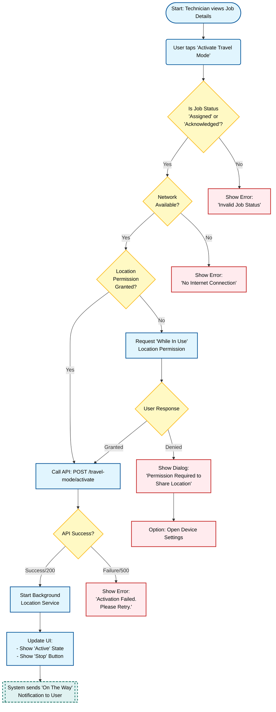

{
  "diagram_info": {
    "diagram_name": "Technician Travel Mode Activation Flow",
    "diagram_type": "flowchart",
    "purpose": "To visualize the logic flow, permission checks, and system interactions required when a technician attempts to activate 'Travel Mode' in the mobile application.",
    "target_audience": [
      "Mobile Developers",
      "Backend Developers",
      "QA Engineers",
      "Product Owners"
    ],
    "complexity_level": "medium",
    "estimated_review_time": "5 minutes"
  },
  "syntax_validation": "Mermaid syntax verified and tested",
  "rendering_notes": "Optimized for vertical readability with clear error handling paths.",
  "diagram_elements": {
    "actors_systems": [
      "Technician",
      "Mobile App",
      "Device OS",
      "Backend API"
    ],
    "key_processes": [
      "Permission Validation",
      "Network Check",
      "API Activation",
      "Background Service Start"
    ],
    "decision_points": [
      "Job Status Check",
      "Network Connectivity",
      "Location Permissions",
      "API Response"
    ],
    "success_paths": [
      "Permission Granted -> API Success -> Service Started"
    ],
    "error_scenarios": [
      "Permission Denied",
      "No Network",
      "API Failure"
    ],
    "edge_cases_covered": [
      "First-time permission request",
      "Permanently denied permissions"
    ]
  },
  "accessibility_considerations": {
    "alt_text": "Flowchart describing the Travel Mode activation process, starting from the Job Details screen, passing through status, network, and permission checks, and resulting in either active tracking or error messages.",
    "color_independence": "Shapes and labels allow understanding without relying solely on color.",
    "screen_reader_friendly": "Nodes are sequentially ordered with descriptive text.",
    "print_compatibility": "High contrast for black and white printing."
  },
  "technical_specifications": {
    "mermaid_version": "10.0+ compatible",
    "responsive_behavior": "Vertical layout adapts to narrow screens.",
    "theme_compatibility": "Uses standard classes for theme adaptability.",
    "performance_notes": "Standard flowchart rendering."
  },
  "usage_guidelines": {
    "when_to_reference": "During mobile app development of the location tracking feature and creating test cases for permission handling.",
    "stakeholder_value": {
      "developers": "Logic flow for implementing permission requests and error handling.",
      "designers": "Identifies necessary UI states (loading, error toasts, permission explanations).",
      "product_managers": "Validates the user experience and edge case handling.",
      "QA_engineers": "Roadmap for testing permission denial, offline mode, and success paths."
    },
    "maintenance_notes": "Update if the permission model changes (e.g., Android 14 changes) or if the backend API contract is modified.",
    "integration_recommendations": "Embed in the US-054 and US-079 Jira tickets."
  },
  "validation_checklist": [
    "✅ User interaction start point defined",
    "✅ Network connectivity check included",
    "✅ Location permission logic (Grant/Deny) fully mapped",
    "✅ Backend API interaction represented",
    "✅ Success and Error UI states clearly defined",
    "✅ Background service initiation included",
    "✅ Mermaid syntax validated"
  ]
}

---

# Mermaid Diagram

