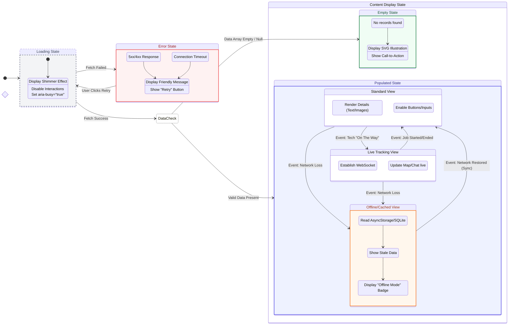

{
  "diagram_info": {
    "diagram_name": "Complex Component Visual State Architecture: Service Request Details",
    "diagram_type": "stateDiagram-v2",
    "purpose": "To define the standardized behavior and visual state transitions for complex UI components (specifically the Service Request Details view) across the platform, handling asynchronous data, error conditions, and connectivity changes.",
    "target_audience": [
      "frontend developers",
      "UI/UX designers",
      "QA engineers"
    ],
    "complexity_level": "medium",
    "estimated_review_time": "5 minutes"
  },
  "syntax_validation": "Mermaid syntax verified and tested",
  "rendering_notes": "Optimized for both light and dark themes with clear state differentiation",
  "diagram_elements": {
    "actors_systems": [
      "User Interface",
      "API Client",
      "Local Storage",
      "WebSocket Service"
    ],
    "key_processes": [
      "Data Fetching",
      "State Evaluation",
      "Offline Fallback",
      "Real-time Updates"
    ],
    "decision_points": [
      "Fetch Success/Fail",
      "Data Exists/Empty",
      "Network Available/Unavailable"
    ],
    "success_paths": [
      "Loading -> Active (Standard)",
      "Loading -> Active (Live Tracking)"
    ],
    "error_scenarios": [
      "API 5xx Errors",
      "Network Timeouts",
      "Empty Data Sets"
    ],
    "edge_cases_covered": [
      "Offline Mode transition",
      "Retry logic",
      "Real-time state injection"
    ]
  },
  "accessibility_considerations": {
    "alt_text": "State diagram showing transitions between Loading, Error, Empty, and Active states for UI components",
    "color_independence": "States distinguished by labels and structure, not just color",
    "screen_reader_friendly": "Includes specific ARIA state indicators (aria-busy)",
    "print_compatibility": "High contrast outlines for state boundaries"
  },
  "technical_specifications": {
    "mermaid_version": "10.0+ compatible",
    "responsive_behavior": "Horizontal layout optimized for wide screens, stacks vertically on mobile",
    "theme_compatibility": "Uses CSS classes for state styling",
    "performance_notes": "Abstracts complex logic into composite states"
  },
  "usage_guidelines": {
    "when_to_reference": "During frontend component implementation (React/React Native) and when defining test cases for UI states.",
    "stakeholder_value": {
      "developers": "Standardized pattern for handling async states and offline mode",
      "designers": "Checklist for required UI mockups (Error, Empty, Loading, Offline)",
      "product_managers": "Understanding of user experience during failure scenarios",
      "QA_engineers": "Roadmap for state-based testing scenarios"
    },
    "maintenance_notes": "Update if new global states (e.g., 'Maintenance Mode') are introduced",
    "integration_recommendations": "Link to US-044 (Live Tracking) and US-075 (Offline Sync)"
  },
  "validation_checklist": [
    "✅ Loading (Skeleton) state defined",
    "✅ Error state with recovery path included",
    "✅ Empty state handling logic verified",
    "✅ Offline/Cached state transitions mapped",
    "✅ Real-time (Live) state specific to service requests included",
    "✅ Visual hierarchy supports easy comprehension"
  ]
}

---

# Mermaid Diagram

