{
  "diagram_info": {
    "diagram_name": "High-Level System Architecture & Component Interaction",
    "diagram_type": "flowchart",
    "purpose": "To visualize the end-to-end architecture of the Warranty and Service Management Platform, illustrating how user personas interact with frontend applications, and how those applications consume backend microservices, data stores, and external integrations within the Azure ecosystem.",
    "target_audience": [
      "System Architects",
      "Backend Developers",
      "DevOps Engineers",
      "Technical Stakeholders"
    ],
    "complexity_level": "high",
    "estimated_review_time": "10-15 minutes"
  },
  "syntax_validation": "Mermaid syntax verified for Flowchart TD structure with subgraphs and class styling.",
  "rendering_notes": "Optimized for large screens; uses color coding to distinguish between Users, Clients, Services, Data, and External Systems.",
  "diagram_elements": {
    "actors_systems": [
      "Consumers",
      "Technicians",
      "Administrators (Super, Brand, Service Center)",
      "Mobile Apps (React Native)",
      "Web Portals (Next.js)",
      "Azure API Management",
      "Azure AD B2C",
      "Microservices (User, Product, Request, Location, Notification, Audit)",
      "Azure Service Bus",
      "Data Stores (PostgreSQL, Redis, Blob, OpenSearch)"
    ],
    "key_processes": [
      "User Authentication",
      "Service Request Routing",
      "Real-time Location Tracking",
      "Async Notification Dispatch",
      "OCR Processing",
      "Audit Logging"
    ],
    "decision_points": [
      "Gateway Routing",
      "Auth Token Validation",
      "Service Bus Event Consumption"
    ],
    "success_paths": [
      "Client -> Gateway -> Service -> Database",
      "Service -> Service Bus -> Worker -> External API"
    ],
    "error_scenarios": [
      "Auth Failure at Gateway",
      "Service Bus Dead Lettering (implicit)",
      "External API Fallback"
    ],
    "edge_cases_covered": [
      "Offline Sync (implied via Client/API interaction)",
      "Real-time WebSocket connections"
    ]
  },
  "accessibility_considerations": {
    "alt_text": "High-level system architecture diagram showing users connecting to mobile and web apps, passing through Azure API Management to a microservices layer on AKS, interacting with Azure SQL, Redis, and Blob Storage, and integrating with external services like FCM and Mapbox.",
    "color_independence": "Components are grouped by subgraphs and labeled clearly; color is secondary to structure.",
    "screen_reader_friendly": "Flow is top-down logic: User to Frontend to Backend to Data.",
    "print_compatibility": "High contrast borders and text ensure readability in grayscale."
  },
  "technical_specifications": {
    "mermaid_version": "10.0+ compatible",
    "responsive_behavior": "Vertical layout (TD) for better scrolling on web pages.",
    "theme_compatibility": "Uses standard color palette adaptable to light/dark modes.",
    "performance_notes": "Grouped nodes reduce visual clutter."
  },
  "usage_guidelines": {
    "when_to_reference": "During architectural reviews, onboarding new engineers, and planning infrastructure changes.",
    "stakeholder_value": {
      "developers": "Understanding service boundaries and dependencies.",
      "designers": "Contextualizing user flows within the system constraints.",
      "product_managers": "Visualizing the complexity of features like Real-time Tracking and OCR.",
      "qa_engineers": "Identifying integration points for end-to-end testing."
    },
    "maintenance_notes": "Update when new microservices or external integrations are added.",
    "integration_recommendations": "Include in the System Design Document (SDD) and README files of the repository."
  },
  "validation_checklist": [
    "✅ All user personas represented",
    "✅ All client application types included",
    "✅ Critical Azure infrastructure (APIM, Service Bus, AD B2C) included",
    "✅ Data persistence layers defined (SQL, Redis, Blob)",
    "✅ External integrations (FCM, Mapbox, OCR) mapped",
    "✅ Real-time and Async flows distinguished"
  ]
}

---

# Mermaid Diagram

```mermaid
flowchart TD
    %% Definitions of Styles
    classDef user fill:#e1f5fe,stroke:#01579b,stroke-width:2px,color:#000
    classDef client fill:#f3e5f5,stroke:#4a148c,stroke-width:2px,color:#000
    classDef edge fill:#fff3e0,stroke:#e65100,stroke-width:2px,color:#000
    classDef service fill:#e8f5e9,stroke:#1b5e20,stroke-width:2px,color:#000
    classDef bus fill:#fff9c4,stroke:#fbc02d,stroke-width:2px,color:#000
    classDef data fill:#e0f7fa,stroke:#006064,stroke-width:2px,shape:cylinder,color:#000
    classDef external fill:#eceff1,stroke:#455a64,stroke-width:2px,stroke-dasharray: 5 5,color:#000

    %% Layer 1: Users
    subgraph Users ["User Personas"]
        Consumer[("Consumer User")]
        Technician[("Technician")]
        SCAdmin[("Service Center Admin")]
        BrandAdmin[("Brand Admin")]
        SuperAdmin[("Super Admin")]
    end

    %% Layer 2: Client Applications
    subgraph Client_Layer ["Frontends"]
        MobileApp_User["User Mobile App\n(React Native)"]
        MobileApp_Tech["Technician App\n(React Native)"]
        WebPortal_Admin["Admin Web Portals\n(Next.js)"]
    end

    %% Layer 3: Edge & Security
    subgraph Edge_Layer ["Edge & Security"]
        APIGateway["Azure API Management\n(Gateway & Policy Enforcement)"]
        ADB2C["Azure AD B2C\n(Identity & MFA)"]
    end

    %% Layer 4: Microservices
    subgraph Service_Layer ["Microservices (AKS)"]
        UserService["User & Identity\nService"]
        ProductService["Product & Warranty\nService"]
        RequestService["Service Request\nService"]
        LocationService["Location Tracking\nService (WebSocket)"]
        NotifService["Notification\nService"]
        AuditService["Audit & Reporting\nService"]
        WorkerService["Background Workers\n(OCR, Batch Jobs)"]
    end

    %% Layer 5: Async Messaging
    subgraph Event_Bus ["Async Messaging"]
        ServiceBus["Azure Service Bus\n(Topics & Queues)"]
    end

    %% Layer 6: Data & Storage
    subgraph Data_Layer ["Data & Persistence"]
        PrimaryDB[("Azure PostgreSQL\n(Core Data + PostGIS)")]
        Redis[("Azure Redis Cache\n(Session/Hot Data)")]
        BlobStore[("Azure Blob Storage\n(Invoices/Media)")]
        SearchIndex[("OpenSearch\n(Logs/Search)")]
    end

    %% Layer 7: External Integrations
    subgraph External_Services ["External Integrations"]
        FCM["Firebase Cloud\nMessaging (Push)"]
        AzureComm["Azure Communication\nServices (Email/SMS)"]
        Mapbox["Mapbox API\n(Maps/Geocoding)"]
        OCR["Azure AI Document\nIntelligence"]
    end

    %% Relationships: User to Client
    Consumer --> MobileApp_User
    Consumer --> WebPortal_Admin
    Technician --> MobileApp_Tech
    SCAdmin --> WebPortal_Admin
    BrandAdmin --> WebPortal_Admin
    SuperAdmin --> WebPortal_Admin

    %% Relationships: Client to Edge
    MobileApp_User --> APIGateway
    MobileApp_Tech --> APIGateway
    WebPortal_Admin --> APIGateway
    
    %% Relationships: Auth
    MobileApp_User -.-> ADB2C
    MobileApp_Tech -.-> ADB2C
    WebPortal_Admin -.-> ADB2C
    APIGateway -.-> ADB2C

    %% Relationships: Edge to Services
    APIGateway --> UserService
    APIGateway --> ProductService
    APIGateway --> RequestService
    APIGateway --> LocationService
    APIGateway --> AuditService

    %% Relationships: Service to Bus
    RequestService --> ServiceBus
    ProductService --> ServiceBus
    ServiceBus --> NotifService
    ServiceBus --> WorkerService
    ServiceBus --> AuditService

    %% Relationships: Services to Data
    UserService --> PrimaryDB
    ProductService --> PrimaryDB
    RequestService --> PrimaryDB
    RequestService --> Redis
    LocationService --> Redis
    LocationService --> PrimaryDB
    AuditService --> SearchIndex
    AuditService --> PrimaryDB
    WorkerService --> BlobStore
    ProductService --> BlobStore

    %% Relationships: Services to External
    NotifService --> FCM
    NotifService --> AzureComm
    LocationService --> Mapbox
    WorkerService --> OCR

    %% Apply Styles
    class Consumer,Technician,SCAdmin,BrandAdmin,SuperAdmin user
    class MobileApp_User,MobileApp_Tech,WebPortal_Admin client
    class APIGateway,ADB2C edge
    class UserService,ProductService,RequestService,LocationService,NotifService,AuditService,WorkerService service
    class ServiceBus bus
    class PrimaryDB,Redis,BlobStore,SearchIndex data
    class FCM,AzureComm,Mapbox,OCR external
```

