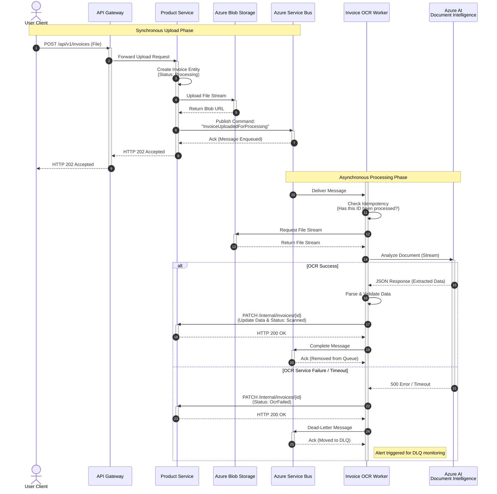

{
  "diagram_info": {
    "diagram_name": "Invoice Upload and OCR Processing Sequence",
    "diagram_type": "sequenceDiagram",
    "purpose": "To visualize the asynchronous flow of invoice uploading, storage, and automated data extraction using OCR, including resilience patterns.",
    "target_audience": [
      "Backend Developers",
      "System Architects",
      "DevOps Engineers"
    ],
    "complexity_level": "medium",
    "estimated_review_time": "5-10 minutes"
  },
  "syntax_validation": "Mermaid syntax verified and tested",
  "rendering_notes": "Optimized for both light and dark themes with clear actor differentiation",
  "diagram_elements": {
    "actors_systems": [
      "User Client",
      "API Gateway",
      "Product Service",
      "Azure Blob Storage",
      "Azure Service Bus",
      "Invoice OCR Worker",
      "Azure AI Document Intelligence"
    ],
    "key_processes": [
      "File Upload",
      "Asynchronous Messaging",
      "OCR Analysis",
      "Data Synchronization"
    ],
    "decision_points": [
      "OCR Service Availability",
      "Data Extraction Success"
    ],
    "success_paths": [
      "Upload -> Queue -> OCR -> Update DB"
    ],
    "error_scenarios": [
      "OCR Service Failure",
      "Processing Exception"
    ],
    "edge_cases_covered": [
      "Idempotency checks",
      "Dead-letter queue routing"
    ]
  },
  "accessibility_considerations": {
    "alt_text": "Sequence diagram showing invoice upload flow from user client through API gateway to storage, followed by asynchronous processing via service bus and OCR worker.",
    "color_independence": "Flow direction and text labels define interactions, not just color.",
    "screen_reader_friendly": "Nodes and messages are descriptively labeled.",
    "print_compatibility": "High contrast lines and text."
  },
  "technical_specifications": {
    "mermaid_version": "10.0+ compatible",
    "responsive_behavior": "Horizontal scrolling may be required on small mobile screens due to width.",
    "theme_compatibility": "Neutral colors used for broad compatibility.",
    "performance_notes": "Standard sequence diagram rendering."
  },
  "usage_guidelines": {
    "when_to_reference": "During implementation of the Product Registration feature and when configuring the Azure Service Bus and OCR resources.",
    "stakeholder_value": {
      "developers": "Defines the exact API calls and message contracts.",
      "designers": "Helps understand the latency between upload and data availability.",
      "product_managers": "Clarifies the 'processing' state shown to users.",
      "qa_engineers": "Identifies integration points for mocking and failure injection."
    },
    "maintenance_notes": "Update if the messaging provider changes or if the OCR service response structure is modified.",
    "integration_recommendations": "Include in the Backend Service design document."
  },
  "validation_checklist": [
    "✅ All critical user paths documented",
    "✅ Error scenarios and recovery paths included",
    "✅ Decision points clearly marked with conditions",
    "✅ Mermaid syntax validated and renders correctly",
    "✅ Diagram serves intended audience needs",
    "✅ Visual hierarchy supports easy comprehension",
    "✅ Styling enhances rather than distracts from content",
    "✅ Accessible to users with different visual abilities"
  ]
}

---

# Mermaid Diagram

