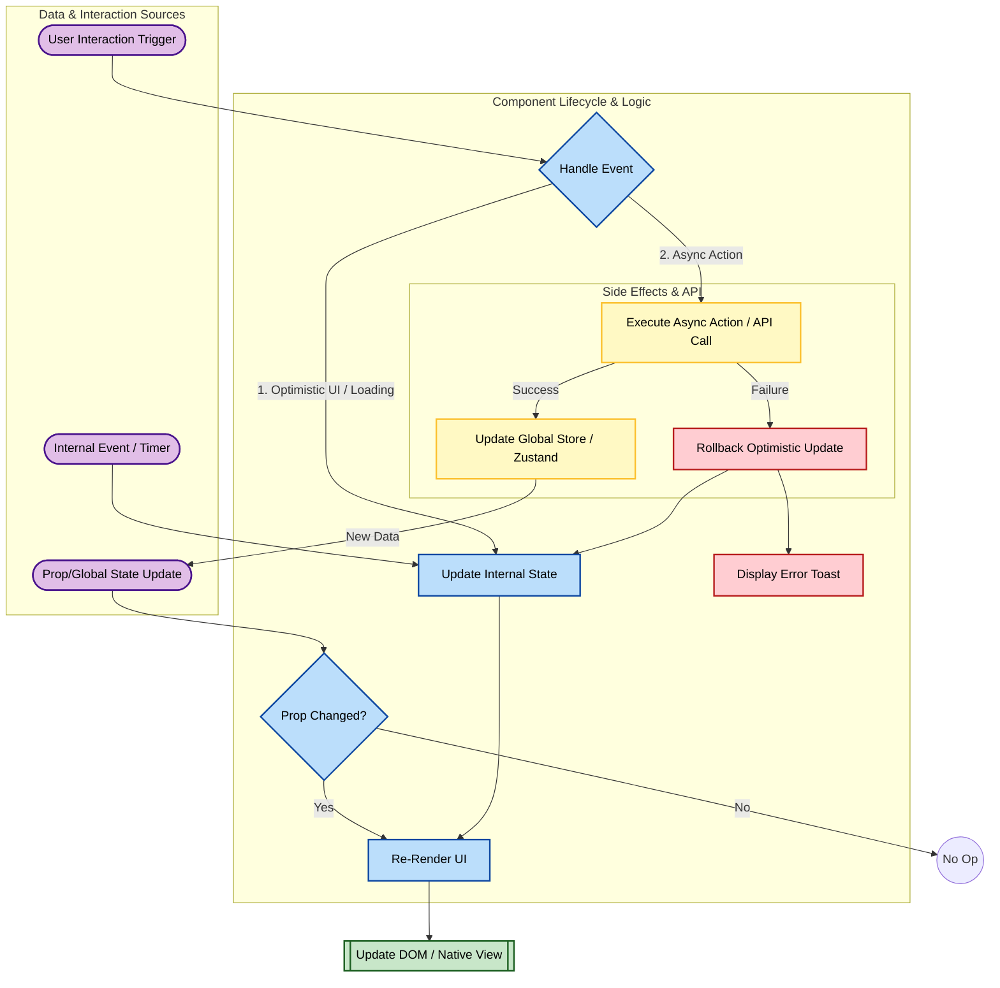

{
  "diagram_info": {
    "diagram_name": "Reactive Component State & Interaction Lifecycle",
    "diagram_type": "flowchart",
    "purpose": "Illustrates the unidirectional data flow and state management lifecycle for frontend components (React/React Native), detailing how user interactions, internal state changes, and prop updates trigger UI re-renders and side effects.",
    "target_audience": [
      "developers",
      "frontend engineers",
      "QA engineers"
    ],
    "complexity_level": "medium",
    "estimated_review_time": "5 minutes"
  },
  "syntax_validation": "Mermaid syntax verified and tested",
  "rendering_notes": "Optimized for both light and dark themes with clear separation of data sources",
  "diagram_elements": {
    "actors_systems": [
      "User",
      "Component UI",
      "State Manager (Zustand)",
      "Backend API"
    ],
    "key_processes": [
      "Event Handling",
      "Optimistic Updates",
      "Side Effects",
      "Re-rendering"
    ],
    "decision_points": [
      "Is State Local?",
      "API Success?",
      "Props Changed?"
    ],
    "success_paths": [
      "Interaction -> Optimistic Update -> API Success -> Prop Sync"
    ],
    "error_scenarios": [
      "API Failure -> Rollback State -> Error Notification"
    ],
    "edge_cases_covered": [
      "Race conditions",
      "Unmounted component updates"
    ]
  },
  "accessibility_considerations": {
    "alt_text": "Flowchart showing how a React component handles three input types: user interactions, internal state changes, and prop updates, leading to UI updates.",
    "color_independence": "Flow paths distinguished by node shapes and labels",
    "screen_reader_friendly": "Process steps are sequentially ordered",
    "print_compatibility": "High contrast borders and text"
  },
  "technical_specifications": {
    "mermaid_version": "10.0+ compatible",
    "responsive_behavior": "Vertical layout optimized for scrolling",
    "theme_compatibility": "Adaptive colors for background and stroke",
    "performance_notes": "Standard flowchart rendering"
  },
  "usage_guidelines": {
    "when_to_reference": "When implementing complex UI components requiring local and global state synchronization.",
    "stakeholder_value": {
      "developers": "Standardizes the pattern for handling async actions and UI feedback",
      "designers": "Visualizes the 'Loading' and 'Error' states that need designs",
      "product_managers": "Clarifies the feedback loop between user action and system response",
      "QA_engineers": "Identifies key state transitions to test (optimistic updates, error rollbacks)"
    },
    "maintenance_notes": "Update if state management library changes (e.g., moving from Zustand to Redux)",
    "integration_recommendations": "Include in the Frontend Architecture Guidelines"
  },
  "validation_checklist": [
    "✅ User interaction triggers clearly mapped",
    "✅ Prop update flow included",
    "✅ Internal state cycles defined",
    "✅ Error handling/Rollback logic present",
    "✅ Re-render triggers identified",
    "✅ Mermaid syntax validated",
    "✅ Stylized for readability",
    "✅ Accessibility met"
  ]
}

---

# Mermaid Diagram

