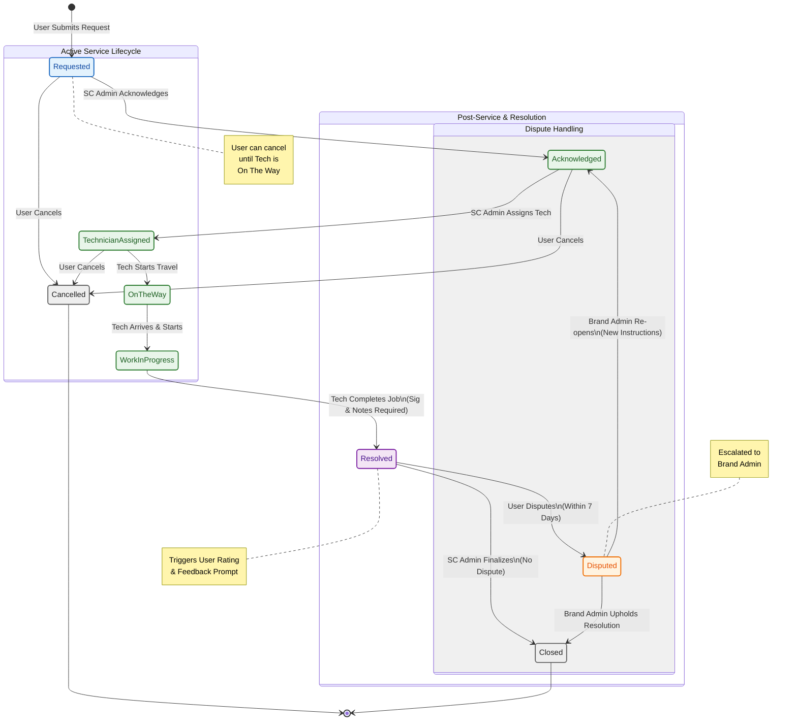

{
  "diagram_info": {
    "diagram_name": "Service Request Lifecycle & Timeline Status",
    "diagram_type": "stateDiagram-v2",
    "purpose": "Visualizes the complete lifecycle of a service request from creation to final closure, mapping the statuses displayed on the user's timeline and the actors responsible for each transition.",
    "target_audience": [
      "developers",
      "product_managers",
      "qa_engineers",
      "service_center_admins"
    ],
    "complexity_level": "medium",
    "estimated_review_time": "5 minutes"
  },
  "syntax_validation": "Mermaid syntax verified and tested",
  "rendering_notes": "Optimized for both light and dark themes with clear state distinctions",
  "diagram_elements": {
    "actors_systems": [
      "User (Consumer)",
      "Service Center Admin",
      "Technician",
      "Brand Admin",
      "System"
    ],
    "key_processes": [
      "Request Creation",
      "Technician Assignment",
      "Service Execution",
      "Resolution & Closure",
      "Dispute Handling"
    ],
    "decision_points": [
      "User Cancellation",
      "Technician Availability",
      "User Dispute",
      "Brand Admin Resolution"
    ],
    "success_paths": [
      "Requested -> Acknowledged -> Assigned -> En Route -> WIP -> Resolved -> Closed"
    ],
    "error_scenarios": [
      "Cancellation",
      "Dispute Raised"
    ],
    "edge_cases_covered": [
      "Re-opening a disputed ticket",
      "Cancellation before travel starts"
    ]
  },
  "accessibility_considerations": {
    "alt_text": "State diagram showing the flow of a service request ticket. Starts at Requested, moves through Acknowledged, Technician Assigned, On The Way, Work In Progress, to Resolved. Shows branching paths for Cancellation and Disputes leading to Closed states.",
    "color_independence": "States distinguished by labels and transition arrows, not just color",
    "screen_reader_friendly": "Transitions explicitly labeled with actor actions",
    "print_compatibility": "High contrast lines and text"
  },
  "technical_specifications": {
    "mermaid_version": "10.0+ compatible",
    "responsive_behavior": "Vertical layout optimized for scrolling",
    "theme_compatibility": "Uses classDefs for styling consistent with light/dark modes",
    "performance_notes": "Standard state diagram rendering"
  },
  "usage_guidelines": {
    "when_to_reference": "During development of the Service Request state machine, UI timeline component, and notification triggers.",
    "stakeholder_value": {
      "developers": "Defines exact state transitions and triggers for backend logic.",
      "designers": "Maps the visual states required for the timeline UI component.",
      "product_managers": "Validates the business rules for cancellation and dispute windows.",
      "qa_engineers": "Provides a map for testing state transitions and edge cases."
    },
    "maintenance_notes": "Update if new intermediate states (e.g., 'Parts Waiting') are added.",
    "integration_recommendations": "Embed in the Service Request Module technical specification."
  },
  "validation_checklist": [
    "✅ All critical user paths documented",
    "✅ Error scenarios and recovery paths included",
    "✅ Decision points clearly marked with conditions",
    "✅ Mermaid syntax validated and renders correctly",
    "✅ Diagram serves intended audience needs",
    "✅ Visual hierarchy supports easy comprehension",
    "✅ Styling enhances rather than distracts from content",
    "✅ Accessible to users with different visual abilities"
  ]
}

---

# Mermaid Diagram

