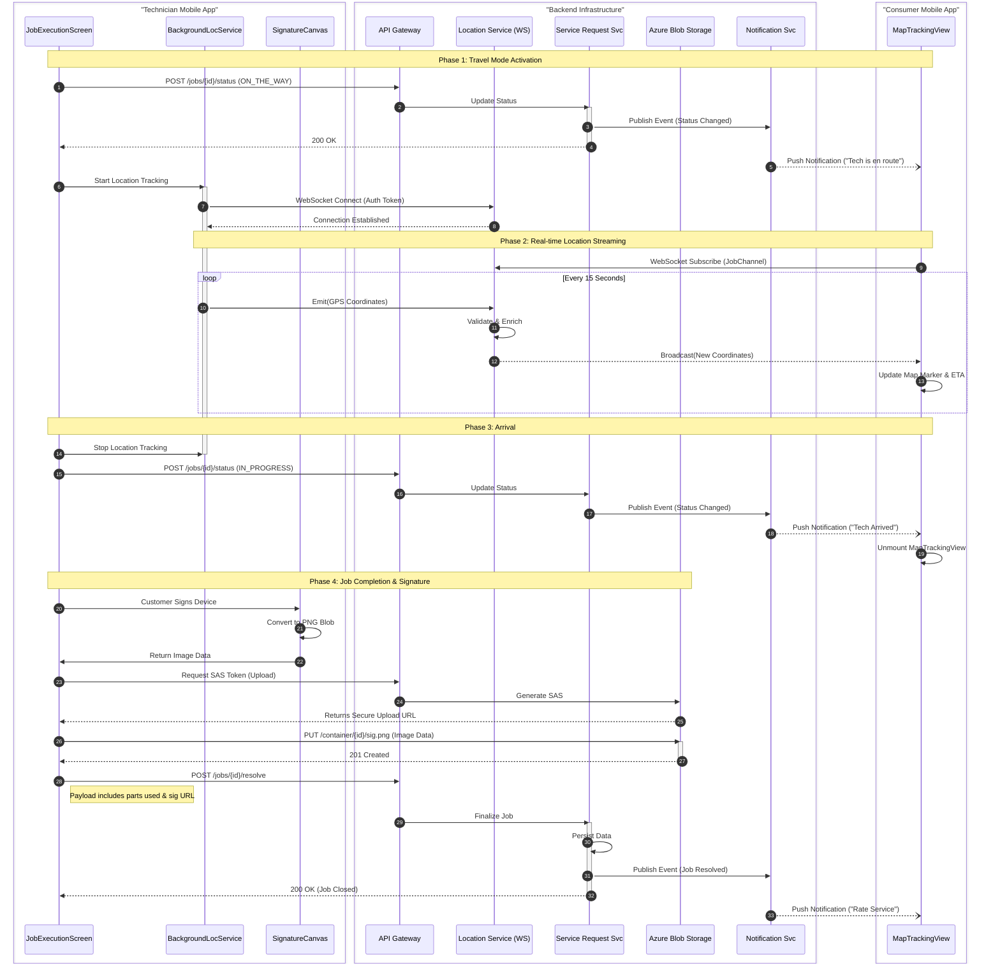

{
  "diagram_info": {
    "diagram_name": "Technician Service Workflow: Component Interaction Sequence",
    "diagram_type": "sequenceDiagram",
    "purpose": "Documents the complex interaction flow between the Technician Mobile App components, the Consumer Mobile App components, and backend services during the critical 'Travel' and 'Job Completion' phases. It highlights the real-time location streaming via WebSockets and the secure signature upload process.",
    "target_audience": [
      "Mobile Developers",
      "Backend Engineers",
      "QA Engineers",
      "System Architects"
    ],
    "complexity_level": "high",
    "estimated_review_time": "10-15 minutes"
  },
  "diagram_elements": {
    "actors_systems": [
      "Technician App (JobExecutionScreen)",
      "Technician App (BackgroundLocService)",
      "Consumer App (MapTrackingView)",
      "API Gateway",
      "Location Service (WebSocket)",
      "Service Request Service",
      "Azure Blob Storage",
      "Notification Service"
    ],
    "key_processes": [
      "Job Status Transition",
      "Real-time Location Streaming",
      "Signature Capture & Upload",
      "Job Completion"
    ],
    "decision_points": [
      "Status Update Validation",
      "Location Permission Check",
      "Signature Upload Success"
    ],
    "success_paths": [
      "Travel Mode Activation -> Streaming -> Arrival -> Signature Upload -> Job Resolution"
    ],
    "error_scenarios": [
      "WebSocket Disconnection",
      "Blob Storage Upload Failure"
    ],
    "edge_cases_covered": [
      "Background location updates",
      "Offline signature capture (implied via local storage handling)"
    ]
  },
  "accessibility_considerations": {
    "alt_text": "Sequence diagram showing the flow of data from the Technician app updating job status, streaming location to the consumer app, and uploading a digital signature to close the ticket.",
    "color_independence": "Standard Mermaid high-contrast styling used; flow direction indicates sequence regardless of color.",
    "screen_reader_friendly": "Nodes and messages use descriptive text labels.",
    "print_compatibility": "Diagram optimized for vertical reading flow."
  },
  "technical_specifications": {
    "mermaid_version": "10.0+ compatible",
    "responsive_behavior": "Vertical layout scales well for scrollable documentation",
    "theme_compatibility": "Neutral color scheme compatible with light/dark modes",
    "performance_notes": "Focuses on logical data flow rather than internal class-level details to maintain readability."
  },
  "usage_guidelines": {
    "when_to_reference": "During implementation of the 'Travel Mode' and 'Complete Job' features in the mobile apps.",
    "stakeholder_value": {
      "developers": "Defines exact API calls and WebSocket events required.",
      "designers": "Visualizes the timing of UI state changes (e.g., when to show the map vs. the signature pad).",
      "product_managers": "Validates the user experience flow across two distinct apps.",
      "qa_engineers": "Provides a step-by-step test plan for the real-time tracking feature."
    },
    "maintenance_notes": "Update if the WebSocket protocol or Blob Storage authentication method changes.",
    "integration_recommendations": "Include in the technical design document for the Service Request Module."
  },
  "validation_checklist": [
    "✅ Includes both Technician and Consumer client interactions",
    "✅ Details the WebSocket real-time loop",
    "✅ Covers the file upload for signatures",
    "✅ Shows asynchronous notification triggers",
    "✅ Valid Mermaid syntax",
    "✅ Clear actor distinctions (UI vs Background Service)"
  ]
}

---

# Mermaid Diagram

