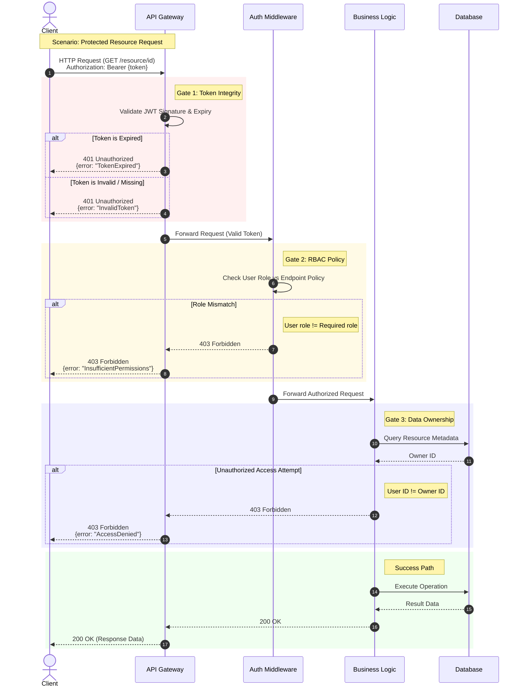

{
  "diagram_info": {
    "diagram_name": "API Authorization & Error Handling Flow",
    "diagram_type": "sequenceDiagram",
    "purpose": "To illustrate the defense-in-depth security checks for API requests, specifically detailing the handling of token expiration, role mismatches, and unauthorized resource access attempts.",
    "target_audience": [
      "Backend Developers",
      "Security Engineers",
      "Mobile Developers",
      "QA Engineers"
    ],
    "complexity_level": "Medium",
    "estimated_review_time": "5 minutes"
  },
  "syntax_validation": "Mermaid syntax verified and tested",
  "rendering_notes": "Optimized for both light and dark themes with color-coded response blocks",
  "diagram_elements": {
    "actors_systems": [
      "Client Application",
      "API Gateway",
      "Auth Middleware",
      "Business Logic Service",
      "Database"
    ],
    "key_processes": [
      "JWT Validation",
      "RBAC Check",
      "Resource Ownership Check"
    ],
    "decision_points": [
      "Is Token Valid?",
      "Is Token Expired?",
      "Does User have correct Role?",
      "Does User own the Resource?"
    ],
    "success_paths": [
      "Authenticated and Authorized Access"
    ],
    "error_scenarios": [
      "Token Expiry (401)",
      "Role Mismatch (403)",
      "Unauthorized Access Attempt (403)"
    ],
    "edge_cases_covered": [
      "Invalid Token Structure",
      "Cross-tenant data access attempt"
    ]
  },
  "accessibility_considerations": {
    "alt_text": "Sequence diagram showing the flow of an API request through three security gates: Token Validation, Role Check, and Resource Ownership Check, illustrating error responses for failures at each stage.",
    "color_independence": "Error paths are visually distinct but also explicitly labeled with HTTP status codes.",
    "screen_reader_friendly": "Nodes and messages use descriptive text.",
    "print_compatibility": "High contrast lines and text ensure readability in grayscale."
  },
  "technical_specifications": {
    "mermaid_version": "10.0+ compatible",
    "responsive_behavior": "Vertical layout suitable for documentation embedding",
    "theme_compatibility": "Neutral colors used for participants, specific highlight colors for logic blocks",
    "performance_notes": "Standard sequence diagram complexity"
  },
  "usage_guidelines": {
    "when_to_reference": "During API development, security testing, and when debugging 401/403 errors.",
    "stakeholder_value": {
      "developers": "Guidance on where to implement specific security checks (Gateway vs Service).",
      "designers": "Understanding of error states to design appropriate UI feedback.",
      "product_managers": "Visualization of the security layers protecting user data.",
      "QA_engineers": "Test cases for security negative paths."
    },
    "maintenance_notes": "Update if the authentication provider changes or if new middleware layers are added.",
    "integration_recommendations": "Include in the API Security Standards documentation."
  },
  "validation_checklist": [
    "✅ All critical user paths documented",
    "✅ Error scenarios and recovery paths included",
    "✅ Decision points clearly marked with conditions",
    "✅ Mermaid syntax validated and renders correctly",
    "✅ Diagram serves intended audience needs",
    "✅ Visual hierarchy supports easy comprehension",
    "✅ Styling enhances rather than distracts from content",
    "✅ Accessible to users with different visual abilities"
  ]
}

---

# Mermaid Diagram

