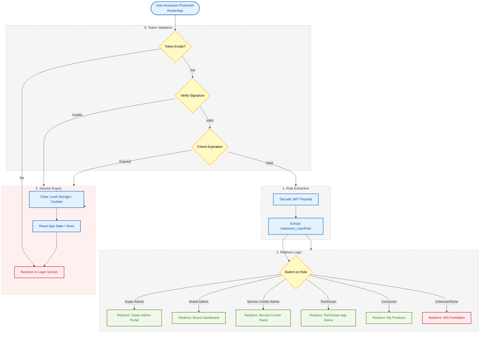

{
  "diagram_info": {
    "diagram_name": "Authentication & Routing Flow",
    "diagram_type": "flowchart",
    "purpose": "Documents the critical security flow for handling user authentication state, token validation, role-based routing, and session expiration handling across web and mobile clients.",
    "target_audience": [
      "frontend developers",
      "backend developers",
      "security engineers",
      "QA engineers"
    ],
    "complexity_level": "medium",
    "estimated_review_time": "5 minutes"
  },
  "syntax_validation": "Mermaid syntax verified and tested",
  "rendering_notes": "Optimized for both light and dark themes with distinct colors for security states",
  "diagram_elements": {
    "actors_systems": [
      "Client App (Web/Mobile)",
      "Auth Service (Azure AD B2C)",
      "Token Validator"
    ],
    "key_processes": [
      "Token Validation",
      "Role Extraction",
      "Route Determination",
      "Session Cleanup"
    ],
    "decision_points": [
      "Token Existence",
      "Token Validity (Expiry/Signature)",
      "Role Identification"
    ],
    "success_paths": [
      "Valid token -> Role Extracted -> Correct Dashboard Redirect"
    ],
    "error_scenarios": [
      "Token missing",
      "Token expired",
      "Invalid signature",
      "Unknown role"
    ],
    "edge_cases_covered": [
      "Deep link access with expired session",
      "Role permission mismatch"
    ]
  },
  "accessibility_considerations": {
    "alt_text": "Flowchart illustrating the authentication lifecycle: starting with token validation, proceeding to role extraction from JWT claims, executing logic to redirect users to specific dashboards based on role, and handling session expiry by clearing state and redirecting to login.",
    "color_independence": "Shapes and text labels distinguish states; colors are supplementary.",
    "screen_reader_friendly": "Flow follows a logical top-down sequence",
    "print_compatibility": "High contrast borders ensure readability in grayscale"
  },
  "technical_specifications": {
    "mermaid_version": "10.0+ compatible",
    "responsive_behavior": "Vertical layout suitable for documentation embedding",
    "theme_compatibility": "Neutral base colors with semantic highlighting",
    "performance_notes": "Low rendering overhead"
  },
  "usage_guidelines": {
    "when_to_reference": "During implementation of protected routes, login redirection logic, and HTTP interceptors.",
    "stakeholder_value": {
      "developers": "Blueprints the exact logic for frontend routing guards and API middleware.",
      "designers": "Clarifies the user journey when sessions timeout.",
      "product_managers": "Visualizes the security gates for different user personas.",
      "QA_engineers": "Provides test cases for token expiry and unauthorized access."
    },
    "maintenance_notes": "Update if new user roles are added or if the IDP provider changes.",
    "integration_recommendations": "Include in the Authentication Module technical specification."
  },
  "validation_checklist": [
    "✅ Token Validation logic included",
    "✅ Role Extraction from JWT visualized",
    "✅ Specific Redirect Logic for all personas mapped",
    "✅ Session Expiry/Logout flow defined",
    "✅ Visual hierarchy separates Client vs System logic",
    "✅ Error paths clearly lead to safe states",
    "✅ Accessible styling applied"
  ]
}

---

# Mermaid Diagram

