{
  "diagram_info": {
    "diagram_name": "Azure AD B2C Authentication & Route Guard Flow",
    "diagram_type": "sequenceDiagram",
    "purpose": "To document the secure authentication flow and client-side authorization logic (Route Guards) that protects application routes and API endpoints using Azure AD B2C.",
    "target_audience": [
      "Frontend Developers",
      "Backend Developers",
      "Security Architects",
      "QA Engineers"
    ],
    "complexity_level": "medium",
    "estimated_review_time": "5 minutes"
  },
  "syntax_validation": "Mermaid syntax verified and tested",
  "rendering_notes": "Optimized for both light and dark themes with clear distinction between client and server actions.",
  "diagram_elements": {
    "actors_systems": [
      "User",
      "Client App (Next.js/React Native)",
      "Azure AD B2C",
      "API Gateway",
      "Backend Service"
    ],
    "key_processes": [
      "Route Interception",
      "Token Verification",
      "Role checking",
      "OAuth2 Flow",
      "API Authorization"
    ],
    "decision_points": [
      "Is User Authenticated?",
      "Is Token Expired?",
      "Does User Have Required Role?",
      "Is API Request Valid?"
    ],
    "success_paths": [
      "Authorized navigation to protected route"
    ],
    "error_scenarios": [
      "Unauthenticated redirect",
      "Unauthorized (Role mismatch)",
      "Token Validation Failure"
    ],
    "edge_cases_covered": [
      "Token Refresh (Silent)",
      "Session Timeout"
    ]
  },
  "accessibility_considerations": {
    "alt_text": "Sequence diagram showing user navigation to a protected route, interception by client-side guard, authentication via Azure AD B2C, and final API data retrieval.",
    "color_independence": "Flow paths rely on labels and line types, not just color.",
    "screen_reader_friendly": "Nodes and messages use descriptive, semantic labels.",
    "print_compatibility": "High contrast lines and text for monochrome printing."
  },
  "technical_specifications": {
    "mermaid_version": "10.0+ compatible",
    "responsive_behavior": "Scales width dynamically",
    "theme_compatibility": "Neutral styling",
    "performance_notes": "Focuses on logical flow rather than low-level packet exchange."
  },
  "usage_guidelines": {
    "when_to_reference": "During implementation of frontend routing, auth middleware, and backend security configuration.",
    "stakeholder_value": {
      "developers": "Visualizes the handshakes and token storage expectations.",
      "designers": "Clarifies the user experience during login redirects and error states.",
      "product_managers": "Validates the security flow complies with business rules.",
      "QA_engineers": "Provides test cases for auth boundaries (Access Denied vs Login Redirect)."
    },
    "maintenance_notes": "Update if the Identity Provider changes or if the token storage strategy (e.g., from localStorage to Cookies) is modified.",
    "integration_recommendations": "Embed in the 'Authentication' section of the technical design document."
  },
  "validation_checklist": [
    "✅ Route Guard interception logic included",
    "✅ Azure AD B2C interaction modeled",
    "✅ Role-based access check (Client & Server) depicted",
    "✅ Mermaid syntax validated",
    "✅ Error paths for 401/403 scenarios included",
    "✅ Token usage in API calls shown"
  ]
}

---

# Mermaid Diagram

```mermaid
sequenceDiagram
    autonumber
    actor User
    participant Client as Client App<br/>(Route Guard)
    participant AuthStore as Auth State<br/>(Context/Store)
    participant B2C as Azure AD B2C<br/>(Identity Provider)
    participant API as API Gateway<br/>(Azure APIM)
    participant Backend as Microservice

    Note over User, Client: Scenario: User attempts to access a protected Admin Route

    User->>Client: Navigate to /admin/dashboard
    
    rect rgb(240, 248, 255)
        note right of Client: 🛡️ Client-Side Route Guard
        Client->>AuthStore: Check Authentication Status
        AuthStore-->>Client: Return { isAuthenticated, userRoles, token }
        
        alt is NOT Authenticated
            Client->>User: Redirect to Login Page
            User->>B2C: Enter Credentials & MFA (if enabled)
            B2C->>B2C: Validate Credentials
            B2C-->>Client: Return Auth Code / IdToken + AccessToken
            Client->>AuthStore: Update State (Store Tokens Securely)
            Client->>Client: Re-evaluate Route Guard
        else is Authenticated
            Client->>Client: Continue to Role Check
        end
    end

    rect rgb(255, 250, 240)
        note right of Client: 👮 Authorization Check (RBAC)
        
        alt Role Missing or Mismatch
            Note right of Client: e.g., User has 'Consumer' role but needs 'Admin'
            Client->>User: Redirect to /403-unauthorized
            Note over User: User sees "Access Denied" page
        else Role Matches
            Client->>User: Render /admin/dashboard (Skeleton UI)
            Note right of Client: User sees loading state while data fetches
            
            par Data Fetching
                Client->>API: GET /api/v1/admin/stats<br/>(Authorization: Bearer JWT)
                
                Note over API, Backend: 🔒 Server-Side Defense in Depth
                
                API->>API: Validate JWT Signature & Expiry
                alt Invalid Token
                    API-->>Client: 401 Unauthorized
                    Client->>AuthStore: Clear Session
                    Client->>User: Redirect to Login
                else Valid Token
                    API->>Backend: Forward Request with Claims
                    Backend->>Backend: Verify 'Admin' Role in Claims
                    
                    alt Backend AuthZ Success
                        Backend-->>API: 200 OK { JSON Data }
                        API-->>Client: 200 OK { JSON Data }
                        Client->>User: Render Dashboard Data
                    else Backend AuthZ Failure
                        Backend-->>API: 403 Forbidden
                        API-->>Client: 403 Forbidden
                        Client->>User: Show Error Toast "Permission Denied"
                    end
                end
            end
        end
    end
```

