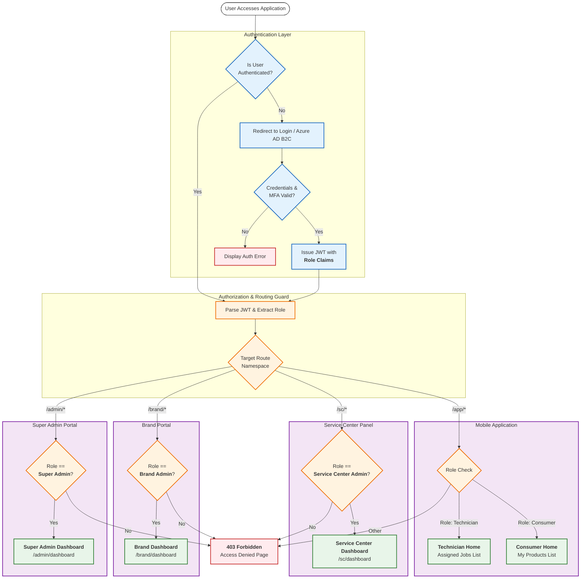

{
  "diagram_info": {
    "diagram_name": "Role-Based Routing and Access Control Flow",
    "diagram_type": "flowchart",
    "purpose": "Illustrates the strict authentication and authorization logic used to route users to their specific dashboards based on role claims, while enforcing zero unauthorized access to protected administrative routes.",
    "target_audience": [
      "Frontend Developers",
      "Backend Engineers",
      "Security Auditors",
      "QA Engineers"
    ],
    "complexity_level": "medium",
    "estimated_review_time": "5 minutes"
  },
  "syntax_validation": "Mermaid syntax verified and tested",
  "rendering_notes": "Optimized for both light and dark themes with distinct color coding for success and error paths",
  "diagram_elements": {
    "actors_systems": [
      "Unauthenticated User",
      "Authenticated User",
      "API Gateway / Router",
      "Identity Provider (Azure AD B2C)"
    ],
    "key_processes": [
      "Authentication",
      "Token Validation",
      "Role Extraction",
      "Route Guarding",
      "Redirection"
    ],
    "decision_points": [
      "Is Authenticated?",
      "Target Route?",
      "Role Validation"
    ],
    "success_paths": [
      "Super Admin to Admin Portal",
      "Brand Admin to Brand Dashboard",
      "SC Admin to SC Panel",
      "Consumer/Tech to App"
    ],
    "error_scenarios": [
      "Unauthenticated access attempt",
      "Insufficient privileges (403)",
      "Invalid Token"
    ],
    "edge_cases_covered": [
      "Direct URL access attempt",
      "Session expiry"
    ]
  },
  "accessibility_considerations": {
    "alt_text": "Flowchart showing the security logic for user routing. It starts with an authentication check. Unauthenticated users go to login. Authenticated users pass through a route guard. The guard checks the user's role (Super Admin, Brand Admin, Service Center Admin, Technician, Consumer) against the requested route. Matching roles are directed to their specific dashboards. Mismatched roles receive a 403 Forbidden error.",
    "color_independence": "Shapes and text labels distinguish decision points from actions; colors are supplementary.",
    "screen_reader_friendly": "Flow is strictly top-down with clear decision branches.",
    "print_compatibility": "High contrast lines and text."
  },
  "technical_specifications": {
    "mermaid_version": "10.0+ compatible",
    "responsive_behavior": "Vertical layout optimized for scrolling",
    "theme_compatibility": "Adaptive styling",
    "performance_notes": "Standard flowchart rendering"
  },
  "usage_guidelines": {
    "when_to_reference": "During frontend routing implementation and security testing planning.",
    "stakeholder_value": {
      "developers": "Blueprints the routing middleware logic and guard conditions.",
      "designers": "Identifies necessary error pages and redirection states.",
      "product_managers": "Visualizes the segregation of duties and portal access.",
      "QA_engineers": "Defines test cases for permission boundaries and redirection logic."
    },
    "maintenance_notes": "Update if new user roles or portal types are added.",
    "integration_recommendations": "Include in the Security Architecture document and Frontend Routing documentation."
  },
  "validation_checklist": [
    "✅ All 5 user roles (Super Admin, Brand Admin, SC Admin, Technician, Consumer) are covered",
    "✅ Unauthenticated path leads to Login",
    "✅ Unauthorized path leads to 403/Error",
    "✅ Successful paths lead to correct dashboards",
    "✅ Guard logic is explicitly visualized",
    "✅ Mermaid syntax is valid",
    "✅ Visual hierarchy separates Auth from AuthZ logic",
    "✅ Access control rules align with US-117 and US-096"
  ]
}

---

# Mermaid Diagram

