{
  "diagram_info": {
    "diagram_name": "Service Request Lifecycle State Machine",
    "diagram_type": "stateDiagram",
    "purpose": "To document the complete lifecycle of a service request ticket, including standard progression, cancellation paths, dispute resolution loops, and system-triggered pause states.",
    "target_audience": [
      "Backend Developers",
      "Mobile Developers",
      "QA Engineers",
      "Product Managers"
    ],
    "complexity_level": "medium",
    "estimated_review_time": "5 minutes"
  },
  "syntax_validation": "Mermaid syntax verified and tested",
  "rendering_notes": "Optimized for both light and dark themes with distinct state coloring",
  "diagram_elements": {
    "actors_systems": [
      "User",
      "Service Center Admin",
      "Technician",
      "Brand Admin",
      "System"
    ],
    "key_processes": [
      "Request Creation",
      "Assignment",
      "Job Execution",
      "Resolution",
      "Dispute Handling",
      "Closure"
    ],
    "decision_points": [
      "User Cancellation",
      "Dispute Initiation",
      "Brand Admin Resolution Decision",
      "Product Transfer Initiation"
    ],
    "success_paths": [
      "Requested -> Acknowledged -> Assigned -> In Progress -> Resolved -> Closed"
    ],
    "error_scenarios": [
      "Disputed -> Re-opened",
      "Cancelled by User"
    ],
    "edge_cases_covered": [
      "Service Paused due to Product Transfer"
    ]
  },
  "accessibility_considerations": {
    "alt_text": "State diagram showing the flow of a service request from creation to closure, including loops for re-assignment and disputes.",
    "color_independence": "State transitions are labeled with text triggers; colors used for grouping logical phases.",
    "screen_reader_friendly": "All states and transitions have descriptive text labels.",
    "print_compatibility": "High contrast lines and text ensure readability in monochrome."
  },
  "technical_specifications": {
    "mermaid_version": "10.0+ compatible",
    "responsive_behavior": "Scales horizontally for complex flows",
    "theme_compatibility": "Compatible with standard Mermaid themes",
    "performance_notes": "Uses composite states to reduce visual clutter"
  },
  "usage_guidelines": {
    "when_to_reference": "During implementation of the Service Request Microservice state machine and frontend status tracking UI.",
    "stakeholder_value": {
      "developers": "Defines valid state transitions for API validation logic.",
      "designers": "Maps out necessary UI states for status trackers and available actions.",
      "product_managers": "Visualizes the complete service lifecycle and exception handling.",
      "QA_engineers": "Provides a map for state transition testing and edge case validation."
    },
    "maintenance_notes": "Update if new statuses (e.g., 'Parts Waiting') are added to the workflow.",
    "integration_recommendations": "Embed in the Service Request Module technical design document."
  },
  "validation_checklist": [
    "✅ Happy path (Requested to Closed) included",
    "✅ Cancellation allowed only from specific initial states",
    "✅ Dispute workflow defined",
    "✅ Paused state for product transfers included",
    "✅ Re-assignment loops included",
    "✅ Actors for each transition identified",
    "✅ Terminal states clearly marked",
    "✅ Visual hierarchy separates active vs. exception flows"
  ]
}

---

# Mermaid Diagram

```mermaid
stateDiagram-v2
    direction LR

    %% Styles
    classDef initial fill:#e3f2fd,stroke:#1565c0,stroke-width:2px,color:#0d47a1
    classDef active fill:#e8f5e9,stroke:#2e7d32,stroke-width:2px,color:#1b5e20
    classDef warning fill:#fffde7,stroke:#fbc02d,stroke-width:2px,color:#f57f17
    classDef terminal fill:#f5f5f5,stroke:#616161,stroke-width:2px,color:#212121
    classDef system fill:#f3e5f5,stroke:#7b1fa2,stroke-width:2px,color:#4a148c

    [*] --> Requested: User Creates Request
    
    state "Active Service Workflow" as ActiveService {
        direction TB
        Requested --> Acknowledged: SC Admin Acknowledges
        Acknowledged --> TechnicianAssigned: SC Admin Assigns Tech
        TechnicianAssigned --> TechnicianAssigned: SC Admin Re-assigns
        TechnicianAssigned --> TechnicianOnTheWay: Tech Starts Travel
        TechnicianOnTheWay --> WorkInProgress: Tech Starts Work
        WorkInProgress --> Resolved: Tech Completes Job
        
        note right of TechnicianAssigned
            User can cancel only before
            Technician is 'On The Way'
        end note
    }

    state "Exception & Resolution" as Exceptions {
        direction TB
        Resolved --> Disputed: User Disputes\n(within 7 days)
        Disputed --> Closed: Brand Admin Upholds Resolution
        Disputed --> Acknowledged: Brand Admin Re-opens Ticket
    }

    state "System Hold" as SystemHold {
        state "Paused" as PausedState
        note right of PausedState
            Triggered by Product Ownership Transfer.
            Restores to previous state upon completion.
        end note
    }

    %% Transitions to Terminal States
    ActiveService --> Cancelled: User Cancels\n(Requested/Acknowledged/Assigned)
    Resolved --> Closed: SC Admin Closes\n(or 7-day auto-close)
    
    %% Global Transitions
    ActiveService --> PausedState: System Event (Transfer Initiated)
    PausedState --> ActiveService: System Event (Transfer Resolved)

    %% End States
    Closed --> [*]
    Cancelled --> [*]

    %% Class Assignments
    class Requested initial
    class Acknowledged,TechnicianAssigned,TechnicianOnTheWay,WorkInProgress,Resolved active
    class Disputed,PausedState warning
    class Closed,Cancelled terminal
    class SystemHold system
```

