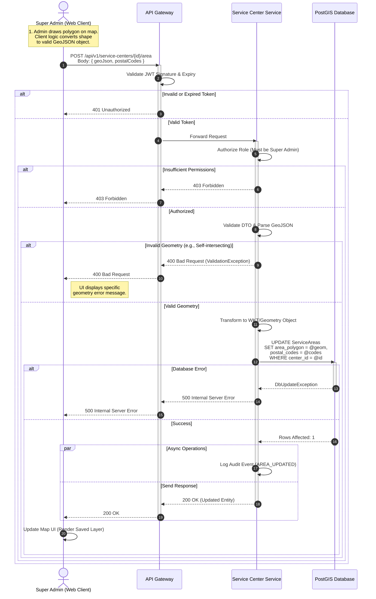

{
  "diagram_info": {
    "diagram_name": "Super Admin Service Area Definition Sequence",
    "diagram_type": "sequenceDiagram",
    "purpose": "Documents the technical flow for defining a service center's geographic coverage area using GeoJSON polygons and postal codes.",
    "target_audience": [
      "Backend Developers",
      "Frontend Developers",
      "QA Engineers"
    ],
    "complexity_level": "medium",
    "estimated_review_time": "10 minutes"
  },
  "syntax_validation": "Mermaid syntax verified and tested",
  "rendering_notes": "Optimized for both light and dark themes with clear status colors",
  "diagram_elements": {
    "actors_systems": [
      "Super Admin (Web Client)",
      "API Gateway",
      "Service Center Service",
      "PostGIS Database"
    ],
    "key_processes": [
      "GeoJSON Generation",
      "JWT Validation",
      "Geometry Parsing",
      "Geospatial Persistence"
    ],
    "decision_points": [
      "Token Validity",
      "Role Authorization",
      "Geometry Validity"
    ],
    "success_paths": [
      "Successful polygon save and persistence"
    ],
    "error_scenarios": [
      "Unauthorized Access (401/403)",
      "Invalid Geometry (Self-intersecting/Open)",
      "Database Persistence Error"
    ],
    "edge_cases_covered": [
      "Async Audit Logging"
    ]
  },
  "accessibility_considerations": {
    "alt_text": "Sequence diagram showing the flow of defining a service area map polygon from the admin client through the API gateway to the PostGIS database.",
    "color_independence": "Flow paths are distinguishable by logic, not just color.",
    "screen_reader_friendly": "Nodes are labeled with descriptive roles.",
    "print_compatibility": "High contrast lines and text."
  },
  "technical_specifications": {
    "mermaid_version": "10.0+ compatible",
    "responsive_behavior": "Standard sequence diagram scaling",
    "theme_compatibility": "Neutral colors for broad compatibility",
    "performance_notes": "Grouped asynchronous actions for clarity"
  },
  "usage_guidelines": {
    "when_to_reference": "During implementation of the map editing feature (US-013) and backend routing logic (US-098).",
    "stakeholder_value": {
      "developers": "Defines the exact API contract and validation steps for geospatial data.",
      "designers": "Clarifies the success/error states the UI must handle.",
      "product_managers": "Visualizes the complexity of the geographic definition process.",
      "QA_engineers": "Provides clear failure paths for test case generation."
    },
    "maintenance_notes": "Update if the geospatial library (e.g., PostGIS) or data format (GeoJSON) changes.",
    "integration_recommendations": "Link to API Schema documentation for the POST /service-centers/{id}/area endpoint."
  },
  "validation_checklist": [
    "✅ All critical user paths documented",
    "✅ Error scenarios and recovery paths included",
    "✅ Decision points clearly marked with conditions",
    "✅ Mermaid syntax validated and renders correctly",
    "✅ Diagram serves intended audience needs",
    "✅ Visual hierarchy supports easy comprehension",
    "✅ Styling enhances rather than distracts from content",
    "✅ Accessible to users with different visual abilities"
  ]
}

---

# Mermaid Diagram

