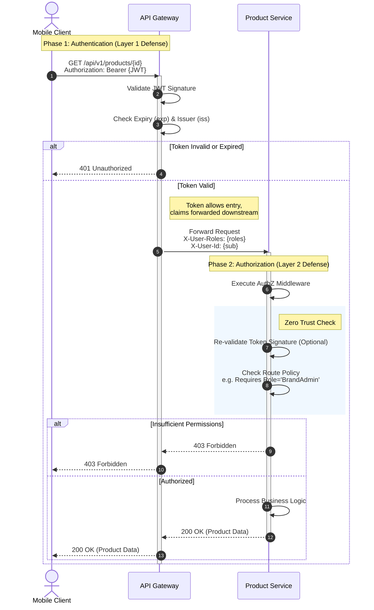

{
  "diagram_info": {
    "diagram_name": "Unified Role-Based Authentication Routing",
    "diagram_type": "sequenceDiagram",
    "purpose": "To visualize the defense-in-depth security model for API requests, detailing the two-layer validation process: authentication at the API Gateway and fine-grained authorization at the Microservice level.",
    "target_audience": [
      "System Architects",
      "Backend Developers",
      "Security Engineers",
      "DevOps Engineers"
    ],
    "complexity_level": "medium",
    "estimated_review_time": "5 minutes"
  },
  "syntax_validation": "Mermaid syntax verified and tested",
  "rendering_notes": "Optimized for high contrast and readability with clear separation of authentication and authorization phases.",
  "diagram_elements": {
    "actors_systems": [
      "Mobile Client",
      "API Gateway",
      "Product Service"
    ],
    "key_processes": [
      "JWT Token Validation",
      "Role-Based Access Control (RBAC)",
      "Zero Trust Verification",
      "Request Forwarding"
    ],
    "decision_points": [
      "Is Token Valid?",
      "Is User Authorized?"
    ],
    "success_paths": [
      "Token valid -> Role authorized -> Resource returned"
    ],
    "error_scenarios": [
      "Token expired/invalid (401)",
      "Insufficient permissions (403)"
    ],
    "edge_cases_covered": [
      "Zero trust re-validation within internal network"
    ]
  },
  "accessibility_considerations": {
    "alt_text": "Sequence diagram showing the flow of a secured API request from a mobile client through an API gateway to a backend service, highlighting validation steps at each layer.",
    "color_independence": "Success and failure paths are distinguished by grouping and labels, not just color.",
    "screen_reader_friendly": "All interactions have descriptive labels indicating the action and data being passed.",
    "print_compatibility": "High contrast lines and text ensure clarity in grayscale."
  },
  "technical_specifications": {
    "mermaid_version": "10.0+ compatible",
    "responsive_behavior": "Horizontal layout scales well for documentation",
    "theme_compatibility": "Neutral styling works with light and dark documentation themes",
    "performance_notes": "Avoids excessive nesting to maintain rendering speed"
  },
  "usage_guidelines": {
    "when_to_reference": "During security audits, backend API implementation, and API Gateway configuration.",
    "stakeholder_value": {
      "developers": "Understanding where to implement authorization logic vs authentication checks",
      "architects": "Validating the Zero Trust architecture implementation",
      "security_engineers": "Verifying the defense-in-depth strategy",
      "devops": "Configuring API Gateway policies correctly"
    },
    "maintenance_notes": "Update if the authentication provider changes or if the gateway logic is offloaded to a sidecar proxy.",
    "integration_recommendations": "Include in the API Security Standards documentation and the Onboarding Guide for new backend developers."
  },
  "validation_checklist": [
    "✅ Layer 1 Authentication (Gateway) visualized",
    "✅ Layer 2 Authorization (Service) visualized",
    "✅ Critical decision points (401/403) included",
    "✅ Zero Trust re-validation step included",
    "✅ Happy path clearly defined",
    "✅ Mermaid syntax validated",
    "✅ Actor roles clearly labeled"
  ]
}

---

# Mermaid Diagram

